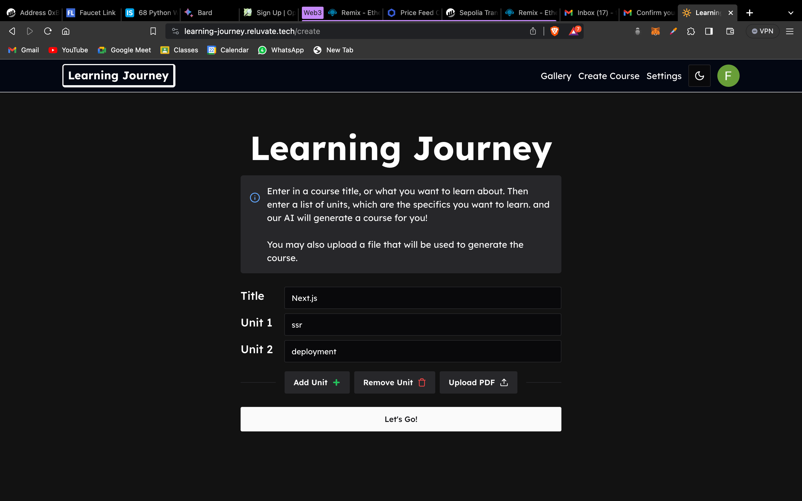
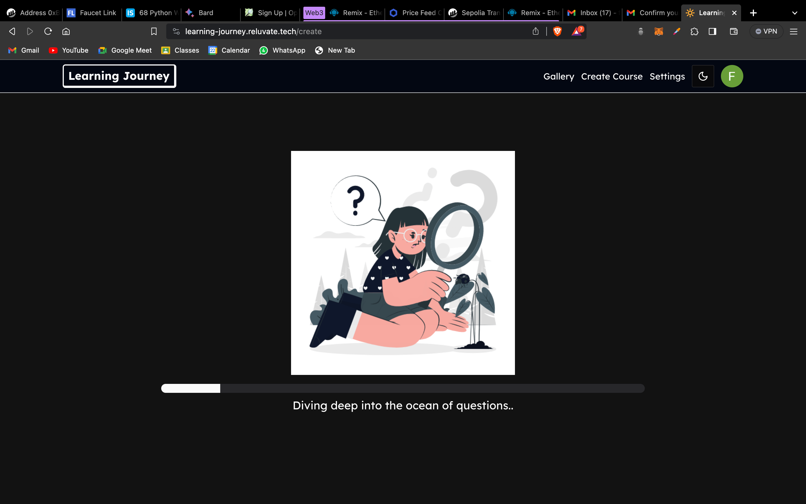
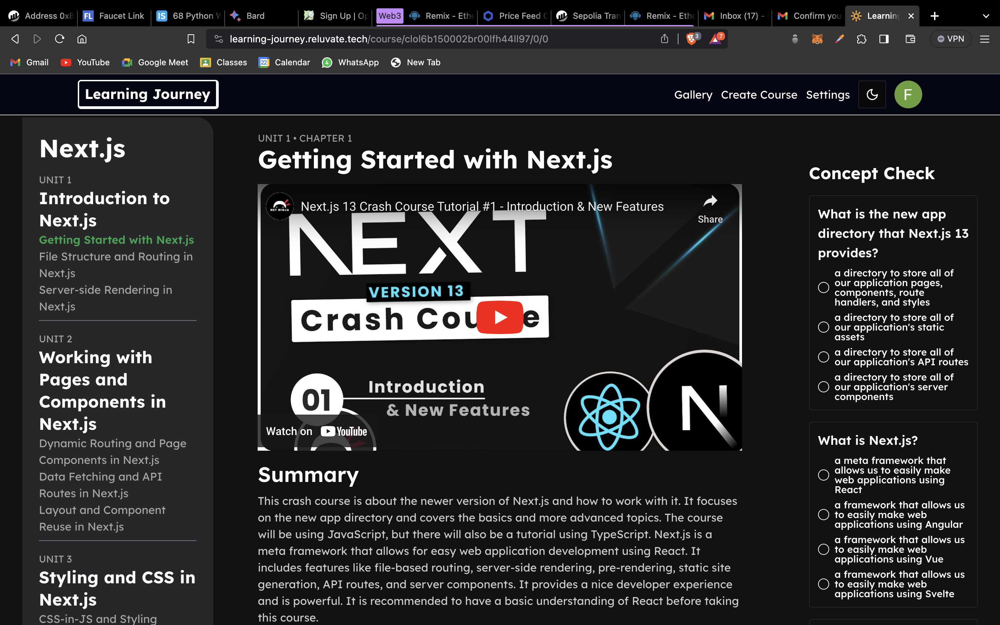
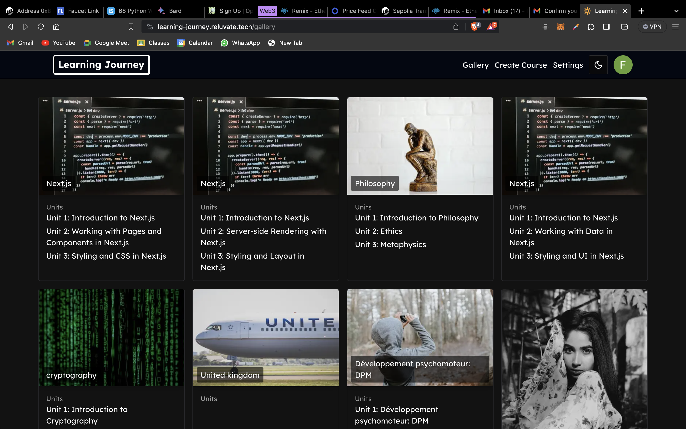

# Sab Ki Pathshaala

**Live Demo**: [sabkipathshaala.study](https://sabkipathshaala.study)

###### Click [here](https://learning-journey.reluvate.tech/gallery) if link does not work

### Problem Statement:

In this fast moving world the smart learner seek quick and precise techniques to learn new topics and technologies, and often learning new things are time consuming. So with the recent developments in ai, how can we use it's capabilities to improve our learning experience?

### Our Solution:

We introduce you to **Sab Ki Pathshala**. A learning app where you enter the topic of your choice, then with the use of ai modals it creates a structured learning plan along with resources to learn from and tests to validate your learnings.

<h4 align="center">Search Screen</h4>

<h4 align="center">Searching In Progress</h4>

<h4 align="center">Learning Plan With Test Questions</h4>

<h4 align="center">Gallery of All Curated Videos</h4>

### About us:

Team Name : **Asterix**

Team No. : 6017

Team Members:

- Mohammad Hatif Osmani

  _Socials : x.com/hatif_15_

- Farhan Ali Mirza

  _Socials : x.com/FarhanAliMirza4_
